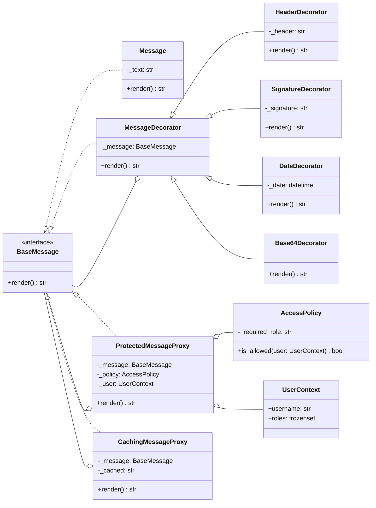

# Структурная диаграмма

```mermaid
classDiagram
    direction LR

    class BaseMessage {
        <<interface>>
        +render() str
    }

    class Message {
        -_text: str
        +render() str
    }

    class MessageDecorator {
        -_message: BaseMessage
        +render() str
    }

    class HeaderDecorator {
        -_header: str
        +render() str
    }

    class SignatureDecorator {
        -_signature: str
        +render() str
    }

    class DateDecorator {
        -_date: datetime
        +render() str
    }

    class Base64Decorator {
        +render() str
    }

    class ProtectedMessageProxy {
        -_message: BaseMessage
        -_policy: AccessPolicy
        -_user: UserContext
        +render() str
    }

    class CachingMessageProxy {
        -_message: BaseMessage
        -_cached: str
        +render() str
    }

    class AccessPolicy {
        -_required_role: str
        +is_allowed(user: UserContext) bool
    }

    class UserContext {
        +username: str
        +roles: frozenset
    }

    BaseMessage <|.. Message
    BaseMessage <|.. MessageDecorator
    MessageDecorator <|-- HeaderDecorator
    MessageDecorator <|-- SignatureDecorator
    MessageDecorator <|-- DateDecorator
    MessageDecorator <|-- Base64Decorator
    BaseMessage <|.. ProtectedMessageProxy
    BaseMessage <|.. CachingMessageProxy
    MessageDecorator o-- BaseMessage
    ProtectedMessageProxy o-- BaseMessage
    CachingMessageProxy o-- BaseMessage
    ProtectedMessageProxy o-- AccessPolicy
    ProtectedMessageProxy o-- UserContext
```